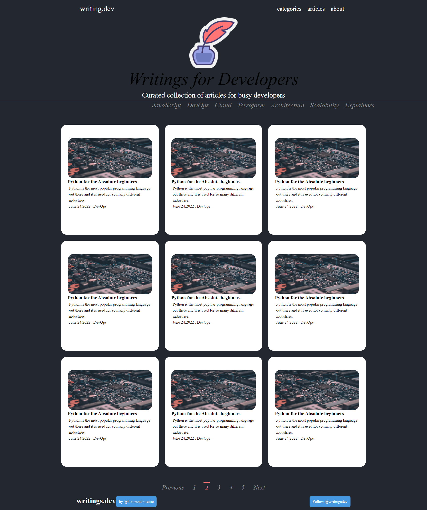

This code represents a static website for developers featuring curated articles. It includes a navigation bar, a header with a logo and site description, a main section with article categories and a grid of article previews, and a footer with site credits. The CSS styles the layout with flexbox, a dark theme, and responsive design elements for a clean, modern look.

